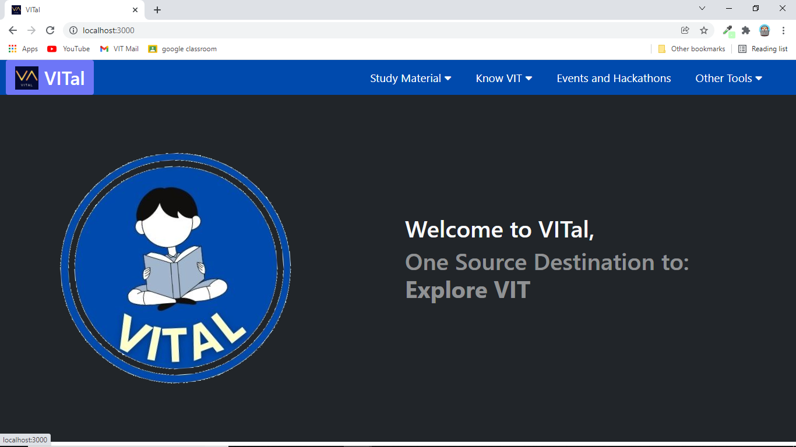
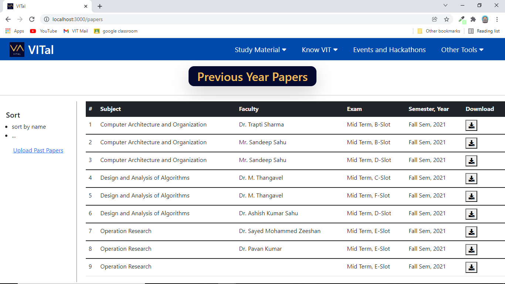
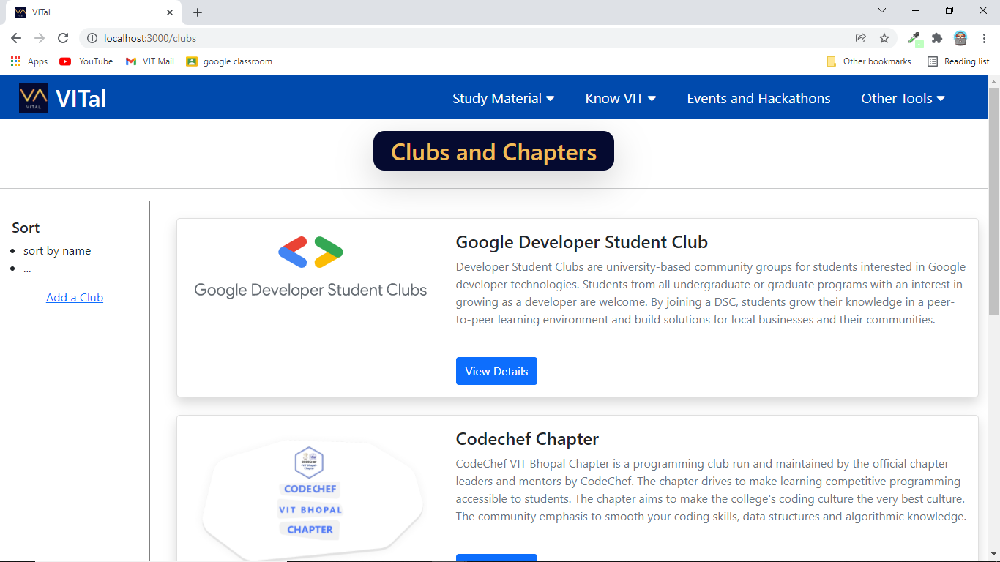
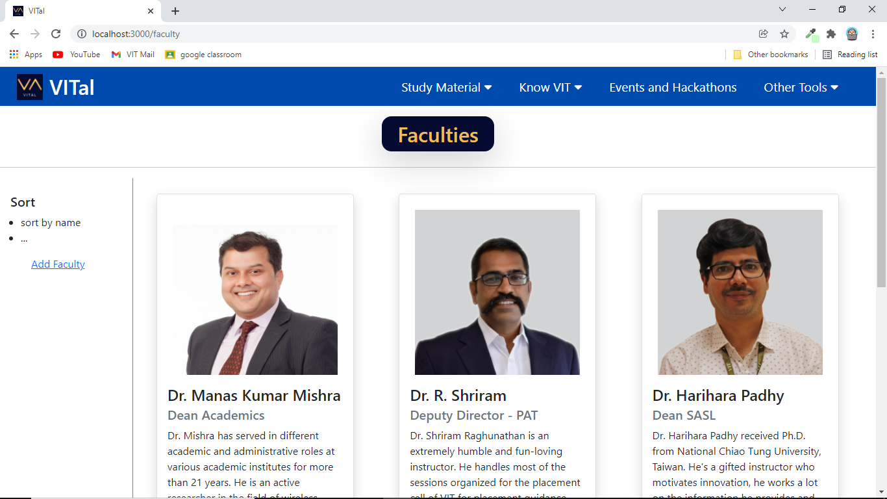
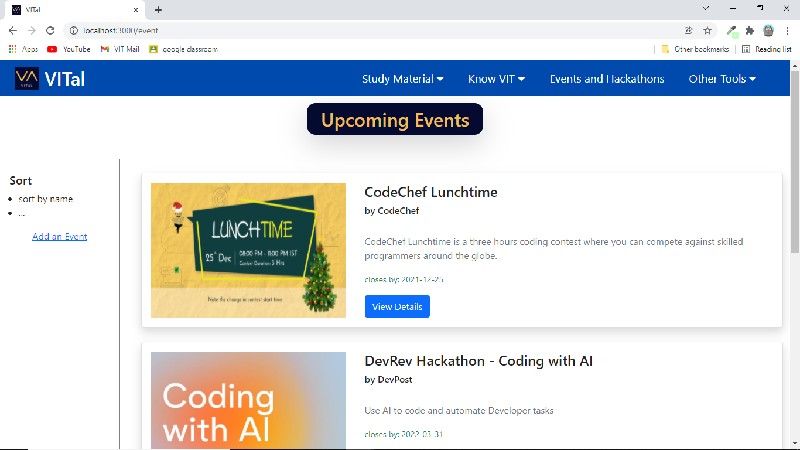
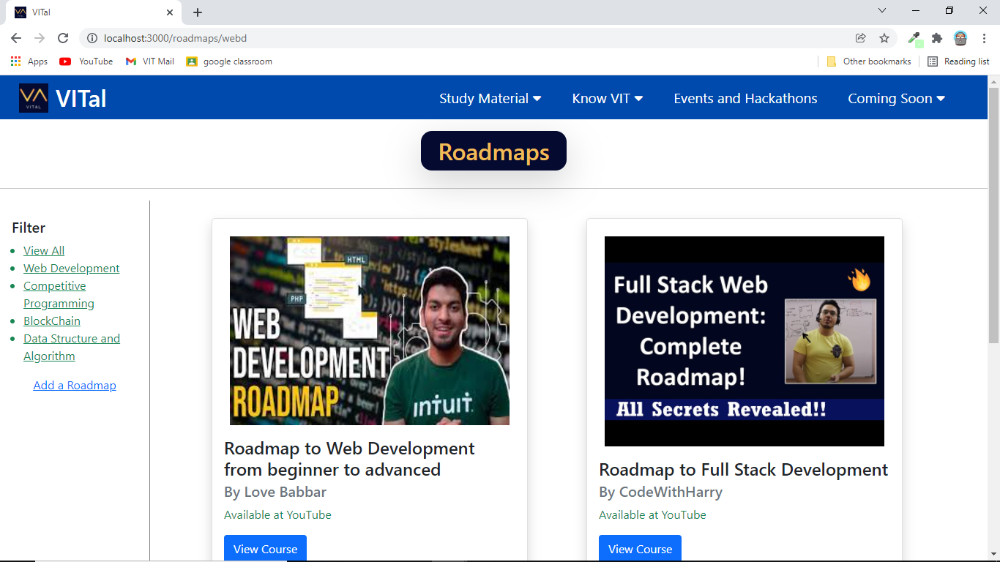
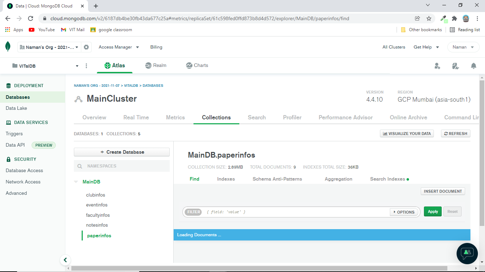

# Project VITal
Project VITal is a web application designed specially for VIT Bhopal students. It aims to solve problems of students by providing all the vital information and documents that they search for and ask seniors about.

This site is easily accessible and provides adequate data efficiently in few simple clicks. You can easily search, sort or filter data as required.

## NOTE
This web app is  under development. Hence, this is just a prototype/idea and still lacks a lot of features shown below.  

## Our website provides
### Study Material (Faculty-wise):
- Class Notes
- Past Papers
- Study Material
- Faculty Details

### Clubs and Chapter Details:
- Coordinator Details 
- Core Team Details
- Past Activity and Upcoming Events
- Vacant Positions and Next Recruitment Season 

### Others: 
- Upcoming Events and Hackathons (Global)
- Free Courses and Certifications
- Roadmaps and Internships
- GPA/CGPA Calculator

## How to view:
This site is not hosted yet, cloning repo and running won't work as this site requires network access to database and hence can't view original data!  

***_Screenshots:_***
  
  
  
  
  
  
  

## Technologies Used:
     
    
   
